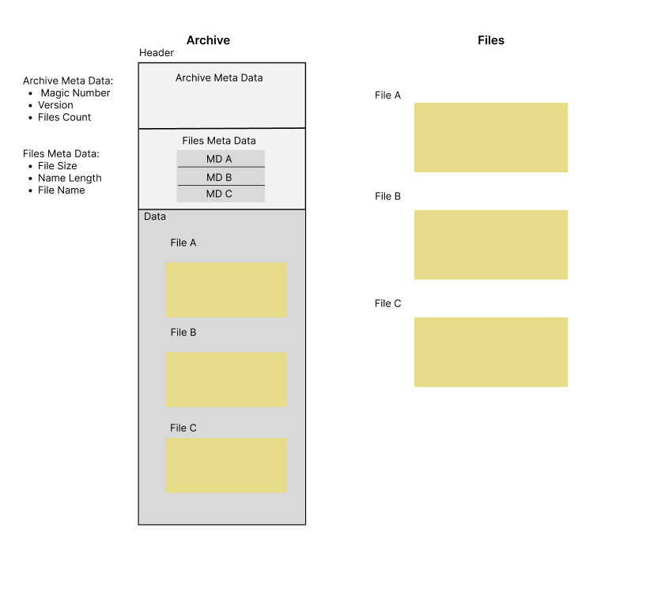

# Archive Files Project

A C command-line tool that bundles multiple files into a single `.PA` archive file and manages them through a set of option flags.

## Overview

The program takes a command-line option and performs the corresponding archive operation. Each option controls a different aspect of managing the archive and the files stored inside it.


## Concept

The project focuses on:

- Command-line argument handling in C
- Binary file I/O operations
- Archive file format design
- Storing and managing file metadata inside a single binary file

The archive file is divided into two sections:

**Header**
- Archive metadata: Magic Number, Version, and File Count
- Files metadata table: containing the File Size, Name Length, and File Name

**Data**
- The raw content of each file is stored sequentially, in the same order as its entries in the file's metadata table

## How It Works

1. The user runs the program from the terminal with an option flag
2. The program parses the option and any additional arguments (archive name, file names)
3. The corresponding operation is performed on the archive file
4. The archive's header and data section are updated to reflect the change

## Options

| Option | Description                    |
|--------|--------------------------------|
| `-c`   | Create a new archive           |
| `-i`   | Insert a file into the archive |
| `-d`   | Delete a file from the archive |
| `-l`   | List all files in the archive  |
| `-x`   | Extract a file from the archive|
| `-h`   | Show help reference            |
| `-n`   | Number of files                |
| `-r`   | replace file                   |


## Example

```bash
Arch -c abc.PA
Arch -i abc.PA file1.txt
Arch -l abc.PA
```

```text
file1.txt
```

<br>


## Specific to Students of 01 Bootcamp

### Project Requirements

| Requirement       | Description                                      |
|-------------------|--------------------------------------------------|
| Multiple Files    | Code must be split across multiple source files  |
| Functions         | Logic must be organized into functions           |
| Clean Code        | Readable, well-structured, and consistent style  |
| Modules           | Code divided into reusable components            |
| Output            | Colored and copyrighted terminal output          |
| Documentation     | Feature and usage documentation in Markdown      |
| Icon + Code Name  | Project has a unique icon and code name          |

### Repository Requirements

| Requirement  | Description                                         |
|--------------|-----------------------------------------------------|
| `src/`       | Directory containing all source code files          |
| `docs/`      | Directory containing documentation files            |
| License      | A license file defining usage rights                |
| Contribution | Guidelines for contributing to the project          |
| Installation | Step-by-step instructions for building and running  |
| README File  | Project overview written in Markdown                |
